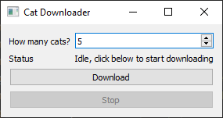

========================
Statement of the problem
========================

It is common in for UI applications to spawn computational intensive operations based on user interaction,
like downloading some files or doing some CPU intensive calculations.

Just calling those blocking functions directly will usually lead to poor user experience, as the UI will become
unresponsive while the blocking operation is taking place.

The usual solution to avoid making the UI unresponsive is to run the expensive operation in a separate thread,
leaving the main thread free to process other user events. However, this often
leads to more complex code, breaking the normal flow of the code, requiring extra bookkeeping, and making
the interaction harder to test.

Example 1: First implementation
-------------------------------

Here is a small application that lets users download random images of cats using `TheCatApi <https://docs.thecatapi.com/>`__.
The user selects the number of cat images to download, and clicks on a button.

Here's the main portion of the code:

.. literalinclude:: examples/explanation_sync.py
   :pyobject: Window

After clicking on the *Download* button, the images will start to be downloaded, and the user will be informed
of the progress in the label. Note also that the code handles not only downloading the images, but also gracefully handles errors (using
``QMessageBox.critical`` to show connection problems), and allows the user to cancel the operation by clicking
on the *Stop* button.

However, the user will have a hard time if they try to actually stop the operation: the application is unresponsive,
sluggish; clicks often don't produce any feedback,so focus and
clicking on the button have no effect, except if the user clicks on the button in quick succession.
Trying to change the number of cats to download also doesn't have a response while the download is taking place.

This happens because the download function is blocking the Qt event loop, so it can't receive user events and process
them accordingly (such as a click event on the *Stop* button).
